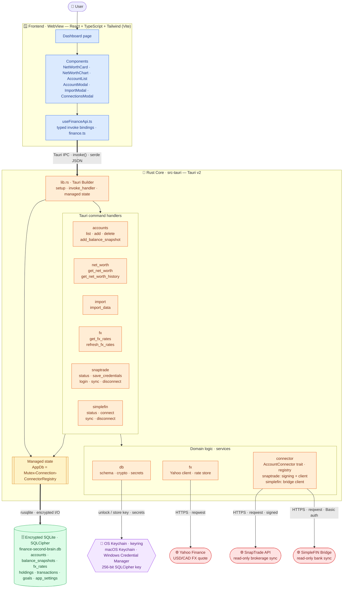
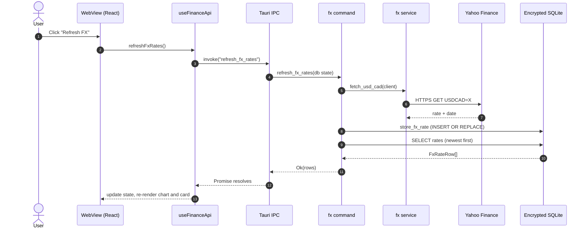

# TrueNorth

A **local-first, privacy-first** desktop app for managing **cross-border (US + Canada)**
personal finances: connect bank + brokerage accounts, review transactions, track
**multi-currency net worth** over time, set goals, and ask a **model-agnostic AI advisor**
questions about your own data.

> Replaces the "paste screenshots into a chatbot" workflow with a real, queryable system.

## Status
✅ **Phase 1 shipped — manual multi-currency MVP.** A Tauri + React/SQLite desktop app with an
**encrypted-at-rest** database (SQLCipher; key in the OS keychain), **multi-currency (USD + CAD)
net worth**, a **net-worth-over-time** chart, and **JSON/CSV import** to seed accounts and balance
history.

🔄 **Phase 2–3 in progress — real account sync.** Connect Robinhood, Questrade, Wealthsimple and
more through **SnapTrade** (free for a single user), and banks through **SimpleFIN** — both pull
**real, read-only balances + holdings** straight into your net worth. The AI advisor is next — see
the roadmap below. Setup lives in [`docs/snaptrade.md`](docs/snaptrade.md) and
[`docs/simplefin.md`](docs/simplefin.md).

## Scope (now)
**Financial transparency + easy decision-making.** Everything is **read-only**.
- Aggregation: brokerages via **SnapTrade** (free single-user), banks via **SimpleFIN Bridge**
  (one ~$15/yr connector covers Chase + Bask + Scotiabank), plus **manual/CSV** fallback.
- **Multi-currency net worth** (USD + CAD) with history chart + dashboard.
- Transaction review (search/filter/categorize) + goals.
- **Model-agnostic AI** (GitHub Models / Ollama / Azure) with a local-only privacy mode.

**Deferred (separate, guarded module later):** automated trading / order execution.

## Stack
Tauri v2 (Rust core) · React + TypeScript + Tailwind · SQLite (rusqlite, SQLCipher) ·
secrets in the OS keychain (`keyring`). Mirrors the TrendWave stack.

## Architecture
Finance Second Brain — **TrueNorth** — is a single **Tauri v2** desktop app: a React/TypeScript **WebView**
frontend talks to a **Rust core** over Tauri's IPC bridge. All data stays on the device in an
**encrypted-at-rest SQLite** database (SQLCipher), with the 256-bit key held in the OS keychain.
Network calls are limited to an on-demand **USD↔CAD** exchange-rate lookup and **read-only**
brokerage sync via the **SnapTrade** API.

**Layers**
- **Frontend (WebView)** — React + TypeScript + Tailwind (Vite). The `Dashboard` page and its
  components (`NetWorthCard`, `NetWorthChart`, `AccountList`, `AccountModal`, `ImportModal`,
  `ConnectionsModal`) call typed `invoke()` bindings in `useFinanceApi.ts`; no business logic lives here.
- **Rust core (`src-tauri`)** — `lib.rs` builds the Tauri app, registers managed state, and routes
  IPC to `#[tauri::command]` handlers (`accounts`, `net_worth`, `import`, `fx`, `snaptrade`). Domain
  logic sits in services: `db` (schema + `crypto` key management + keychain `secrets`), `fx` (Yahoo
  client + rate store), and a `connector` trait/registry whose `snaptrade` module (request signing +
  API client) powers read-only brokerage sync.
- **State** — a single `AppDb(Mutex<Connection>)` and the `ConnectorRegistry`, shared across commands.
- **Persistence** — SQLite encrypted with SQLCipher (`finance-second-brain.db`); the key is generated
  once and stored in the macOS Keychain / Windows Credential Manager via `keyring`. SnapTrade secrets
  (consumer key + user secret) live in the same keychain — never on disk.
- **External** — read-only HTTPS calls to Yahoo Finance (USD↔CAD rate) and the SnapTrade API
  (signed, read-only brokerage sync); everything else is local.

### Request flow — "Refresh FX"

## How to start building
1. Open this folder as a **project** in Copilot.
2. Create a **new session**.
3. Paste the prompt in [`docs/kickoff-prompt.md`](docs/kickoff-prompt.md) to drive **Phase 0 → Phase 1**.

## Building & releasing
Installers for **macOS (universal)** and **Windows (x64)** are built by GitHub Actions and
attached to a draft GitHub Release. Tag a commit `vX.Y.Z` (or run the **Release** workflow
manually), then review and publish the draft. Builds are **unsigned but signing-ready** — add
the Apple/Windows signing secrets to sign automatically. See [`docs/releasing.md`](docs/releasing.md).

## Docs
- [`docs/blueprint.md`](docs/blueprint.md) — full research report (connectors, architecture, cross-border notes, citations).
- [`docs/plan.md`](docs/plan.md) — phased build plan.
- [`docs/kickoff-prompt.md`](docs/kickoff-prompt.md) — ready-to-paste prompt for the first build session.
- [`docs/import.md`](docs/import.md) — importing accounts + balance history (JSON/CSV) and how net-worth history is computed.
- [`docs/snaptrade.md`](docs/snaptrade.md) — connecting brokerages via SnapTrade (read-only) and how sync feeds net worth.
- [`docs/simplefin.md`](docs/simplefin.md) — connecting banks via SimpleFIN (read-only) and how sync feeds net worth.
- [`docs/releasing.md`](docs/releasing.md) — release pipeline, build targets, and code-signing setup.

## Phased roadmap
0. ✅ Scaffold (Tauri/React/SQLite shell, encryption, keychain)
1. ✅ Manual multi-currency net-worth MVP (+ JSON/CSV import)
2. ✅ SnapTrade brokerage sync (read-only balances + holdings)
3. 🔄 SimpleFIN bank sync (read-only balances + holdings)
4. Transactions & goals
5. Model-agnostic AI "second brain"
6. Hardening & polish

## Privacy
Financial data stays **local and encrypted**. Secrets live in the OS keychain, never in
the repo (`.env`, `*.db`, `*.sqlite` are gitignored). For AI, prefer local Ollama or Azure
for real balances; redact/aggregate before using the free GitHub Models tier.
