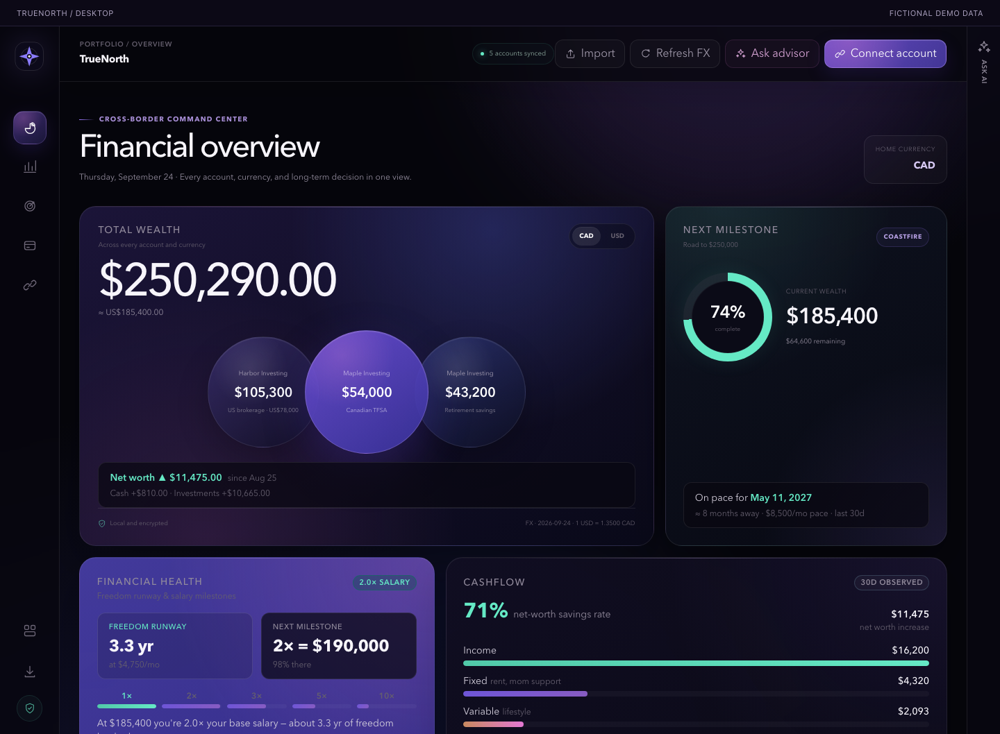
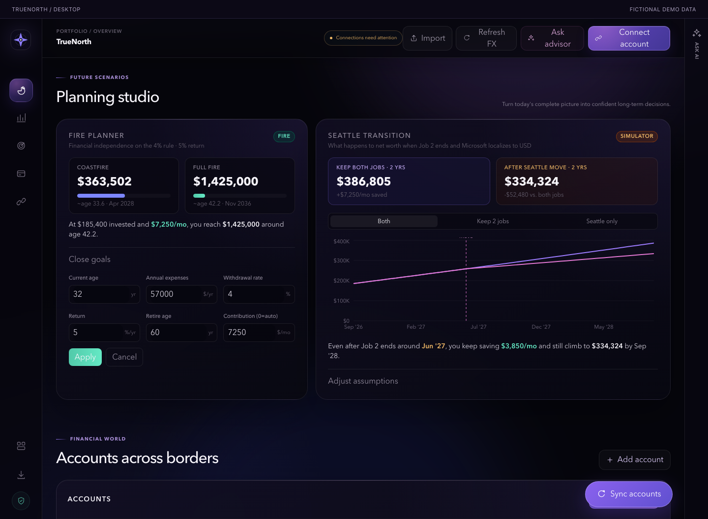
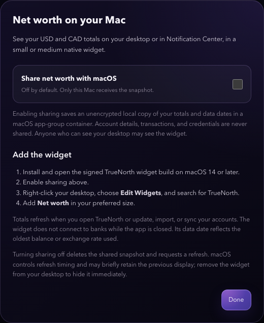
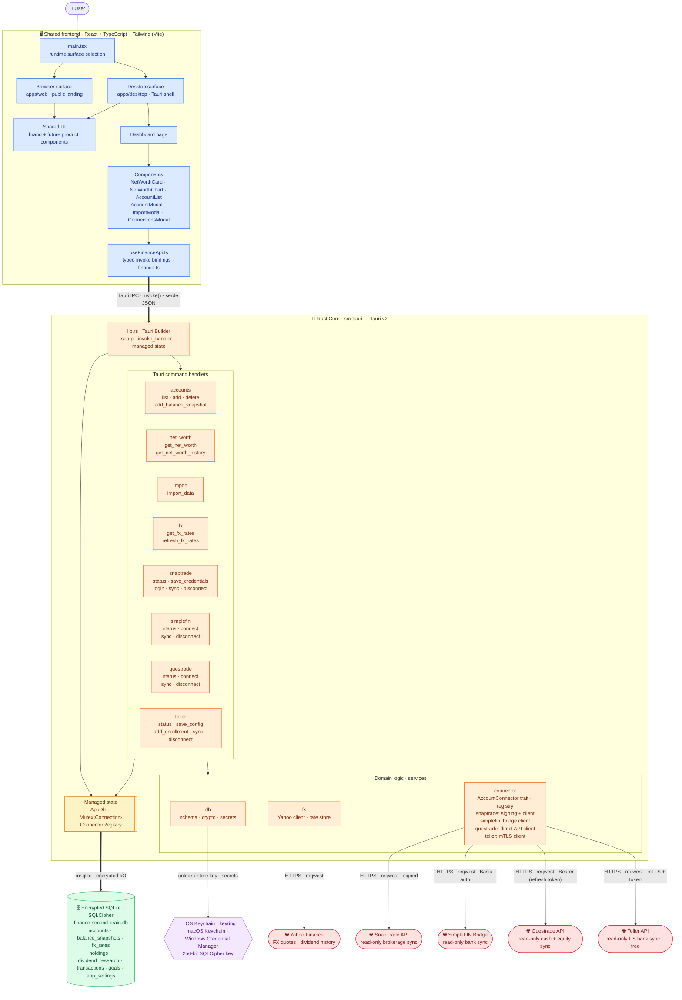
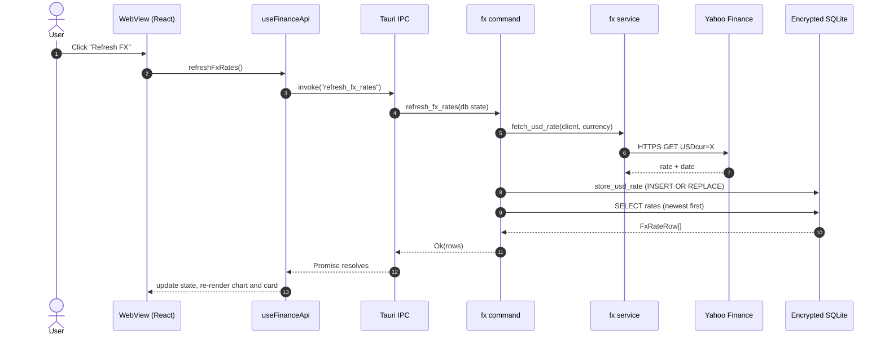

# TrueNorth

A cross-border finance product with a public web experience and a **local-first,
privacy-first** desktop app for managing **US + Canada** personal finances: connect bank +
brokerage accounts, review transactions, track
**multi-currency net worth** over time, set goals, and ask a **model-agnostic AI advisor**
questions about your own data.

> Replaces the "paste screenshots into a chatbot" workflow with a real, queryable system.

<p>
  <a href="https://github.com/daryn-brown/truenorth/releases/latest">
    
  </a>
</p>

Installers are available for **macOS (Apple Silicon + Intel)** and **Windows (x64)**.
The button opens the latest published release. Native Mac widgets require a signed widget build;
see [Mac widget setup](docs/mac-widget.md) for availability and local builds.

## Screenshots

The actual desktop UI, populated with **fictional demo data**. No personal financial data,
real account details, or credentials are included.

### Financial overview

USD/CAD net worth, Investments / Savings / Liabilities totals, progress toward goals, and
balance-aligned cashflow.

The three wealth bubbles group all active accounts: **Investments** includes brokerages,
stock plans, and retirement accounts (including Questrade, Robinhood, Morgan Stanley stock
plans, and Sun Life); **Savings** is cash in chequing, savings, and other recognized cash
accounts; **Liabilities** includes credit cards, loans, and any negative account balance.
Debt is shown as a positive amount owed, with credit balances offsetting it. All groups use
the selected USD/CAD currency and the same exchange rates as total wealth. Unclassified
assets remain in total wealth and are called out separately rather than labeled as cash.



<details>
<summary><strong>Planning studio and Mac widget settings</strong></summary>

### Planning studio

Explore FIRE and CoastFIRE goals alongside a configurable relocation scenario.



### Mac widget setup

Opt-in local sharing, privacy information, and instructions for adding the native widget.



</details>

## Status
**Mac net-worth widget.** Signed macOS builds can share USD and CAD totals with a native
desktop / Notification Center widget in small and medium sizes. Sharing is off by default;
the widget receives only a local summary, never the encrypted database or account credentials.
See [Mac widget setup and builds](docs/mac-widget.md).

💸 **Yearly dividend income shipped.** The desktop dashboard now combines live share counts from
connected investment accounts with daily cached Yahoo Finance distribution research to estimate
annual and monthly dividend income. Dividend cash found in synced transaction history is displayed
separately, with source, coverage, stale-data, and unresolved-ticker indicators.

✨ **Desktop UI 2.0 shipped.** The native app now uses the same immersive violet design language
as the web experience: a compact navigation rail, stronger information hierarchy, spatial
multi-account net-worth view, dense planning studio, and consistent glass surfaces across account
connections, imports, updates, and the finance advisor.

🌐 **Web foundation shipped.** The public browser surface now introduces TrueNorth as the
financial home for people whose wealth spans countries. It shares the React/Vite codebase,
brand components, and release with the desktop product while keeping browser visitors isolated
from Tauri-only finance services.

✅ **Phase 1 shipped — manual multi-currency MVP.** A Tauri + React/SQLite desktop app with an
**encrypted-at-rest** database (SQLCipher), **multi-currency net worth**
(any currency converted into USD + CAD totals), a **net-worth-over-time** chart, and **JSON/CSV import** to seed accounts and balance
history. By default it runs in **open mode** (secrets in a local file, no password prompts — see [Privacy](#privacy)).

🔄 **Phase 2–3 in progress — real account sync.** Connect Robinhood, Questrade, Wealthsimple and
more through **SnapTrade** (free for a single user), and banks through **SimpleFIN** or **Teller**
(free for US banks) — all pull **real, read-only balances + holdings** straight into your net worth.
You can also connect an institution's **own API directly** (the **Direct** tab) — **Questrade** is
supported today, pulling full cash + equity. An **agentic AI advisor** that queries your own data
with read-only tools ships too (your **GitHub Copilot** subscription or fully local **Ollama**) —
see [`docs/ai.md`](docs/ai.md).
Setup lives in [`docs/snaptrade.md`](docs/snaptrade.md), [`docs/simplefin.md`](docs/simplefin.md),
[`docs/teller.md`](docs/teller.md), and [`docs/questrade.md`](docs/questrade.md).

## Scope (now)
**Financial transparency + easy decision-making.** Everything is **read-only**.
- Aggregation: brokerages via **SnapTrade** (free single-user), banks via **SimpleFIN Bridge**
  (one ~$15/yr connector covers Chase + Bask + Scotiabank) or **Teller** (free, US banks),
  **Questrade** via its own free API (full cash + equity, under the **Direct** tab), plus
  **manual/CSV** fallback.
- **Choose accounts to sync** for SnapTrade and SimpleFIN: explicit Create / Link / Ignore,
  durable exclusions, and safe source switches that retain account history without auto-merging.
- **Multi-currency net worth** — any account currency converted into USD + CAD totals — with history chart + dashboard.
- **Native Mac net-worth widget** in signed macOS 14+ builds, with opt-in local sharing.
- **Yearly dividend income** from connected holdings plus trailing distribution research, alongside
  actual dividend payments found in synced transaction history.
- Transaction review (search/filter/categorize) + goals.
- **AI advisor** using your **GitHub Copilot** subscription or local **Ollama**, with rounded-data privacy mode.

**Deferred (separate, guarded module later):** automated trading / order execution.

## Stack
Tauri v2 (Rust core) · React + TypeScript + Tailwind · SQLite (rusqlite, SQLCipher) ·
secrets in the OS keychain (`keyring`). Mirrors the TrendWave stack.

## Architecture
Finance Second Brain — **TrueNorth** — uses one React/TypeScript codebase for two surfaces:
`src/apps/web` is the browser experience and `src/apps/desktop` is the existing **Tauri v2**
application. `src/main.tsx` selects the browser or desktop entry at runtime, and reusable product
UI belongs in `src/shared`. The desktop surface talks to a **Rust core** over Tauri's IPC bridge.
All finance data stays on the device in an **encrypted-at-rest SQLite** database (SQLCipher), with
the 256-bit key held in the OS keychain. Network calls are limited to on-demand exchange-rate
lookups and explicitly configured read-only account connections.


```mermaid
flowchart TB
    user(["👤 User"])

    subgraph FE["🖥️ Shared frontend · React + TypeScript + Tailwind (Vite)"]
        direction TB
        entry["main.tsx<br/>runtime surface selection"]
        web["Browser surface<br/>apps/web · public landing"]
        desktop["Desktop surface<br/>apps/desktop · Tauri shell"]
        shared["Shared UI<br/>brand + future product components"]
        pages["Dashboard page"]
        comps["Components<br/>NetWorthCard · NetWorthChart · AccountList<br/>AccountModal · ImportModal · ConnectionsModal"]
        api["useFinanceApi.ts<br/>typed invoke bindings · finance.ts"]
        entry --> web
        entry --> desktop --> pages
        web --> shared
        desktop --> shared
        pages --> comps --> api
    end

    subgraph CORE["🦀 Rust Core · src-tauri — Tauri v2"]
        direction TB
        builder["lib.rs · Tauri Builder<br/>setup · invoke_handler · managed state"]

        subgraph CMD["Tauri command handlers"]
            direction LR
            c_acc["accounts<br/>list · add · delete<br/>add_balance_snapshot"]
            c_nw["net_worth<br/>get_net_worth<br/>get_net_worth_history"]
            c_imp["import<br/>import_data"]
            c_fx["fx<br/>get_fx_rates<br/>refresh_fx_rates"]
            c_snap["snaptrade<br/>status · save_credentials<br/>login · sync · disconnect"]
            c_sf["simplefin<br/>status · connect<br/>sync · disconnect"]
            c_qt["questrade<br/>status · connect<br/>sync · disconnect"]
            c_te["teller<br/>status · save_config<br/>add_enrollment · sync · disconnect"]
        end

        subgraph SVC["Domain logic · services"]
            direction LR
            d_db["db<br/>schema · crypto · secrets"]
            d_fx["fx<br/>Yahoo client · rate store"]
            d_conn["connector<br/>AccountConnector trait · registry<br/>snaptrade: signing + client<br/>simplefin: bridge client<br/>questrade: direct API client<br/>teller: mTLS client"]
        end

        state[["Managed state<br/>AppDb = Mutex‹Connection›<br/>ConnectorRegistry"]]

        builder --> CMD
        builder --> state
        CMD --> SVC
        CMD --> state
    end

    kc{{"🔐 OS Keychain · keyring<br/>macOS Keychain · Windows Credential Manager<br/>256-bit SQLCipher key"}}
    db[("🗄️ Encrypted SQLite · SQLCipher<br/>finance-second-brain.db<br/>accounts · balance_snapshots · fx_rates<br/>holdings · dividend_research · transactions · goals · app_settings")]
    yahoo(["🌐 Yahoo Finance<br/>FX quotes · dividend history"])
    snaptrade(["🌐 SnapTrade API<br/>read-only brokerage sync"])
    simplefin(["🌐 SimpleFIN Bridge<br/>read-only bank sync"])
    questrade(["🌐 Questrade API<br/>read-only cash + equity sync"])
    teller(["🌐 Teller API<br/>read-only US bank sync · free"])

    user --> entry
    api ==>|"Tauri IPC · invoke() · serde JSON"| builder
    state ==>|"rusqlite · encrypted I/O"| db
    d_db -->|"unlock / store key · secrets"| kc
    d_fx -->|"HTTPS · reqwest"| yahoo
    d_conn -->|"HTTPS · reqwest · signed"| snaptrade
    d_conn -->|"HTTPS · reqwest · Basic auth"| simplefin
    d_conn -->|"HTTPS · reqwest · Bearer (refresh token)"| questrade
    d_conn -->|"HTTPS · reqwest · mTLS + token"| teller

    classDef feNode fill:#dbeafe,stroke:#2563eb,color:#1e3a8a;
    classDef coreNode fill:#ffedd5,stroke:#ea580c,color:#7c2d12;
    classDef stateNode fill:#fef3c7,stroke:#d97706,color:#78350f;
    classDef store fill:#dcfce7,stroke:#16a34a,color:#14532d;
    classDef os fill:#f3e8ff,stroke:#9333ea,color:#581c87;
    classDef ext fill:#fee2e2,stroke:#dc2626,color:#7f1d1d;

    class entry,web,desktop,shared,pages,comps,api feNode;
    class builder,c_acc,c_nw,c_imp,c_fx,c_snap,c_sf,c_qt,c_te,d_db,d_fx,d_conn coreNode;
    class state stateNode;
    class db store;
    class kc os;
    class yahoo,snaptrade,simplefin,questrade,teller ext;
```

**Layers**
- **Frontend surfaces** — React + TypeScript + Tailwind (Vite). Browser navigation loads the
  public experience from `src/apps/web`; the Tauri runtime loads `src/apps/desktop`. The desktop
  `Dashboard` and its components call typed `invoke()` bindings in `useFinanceApi.ts`; no business
  logic lives in either presentation layer. Desktop-specific layout and visual tokens live in
  `src/apps/desktop/desktop.css`.
- **Shared UI** — cross-platform components live in `src/shared`. Move product screens here as the
  authenticated web app grows; inject a browser or Tauri data adapter rather than importing Tauri
  APIs into shared components.
- **Rust core (`src-tauri`)** — `lib.rs` builds the Tauri app, registers managed state, and routes
  IPC to `#[tauri::command]` handlers (`accounts`, `net_worth`, `import`, `fx`, `snaptrade`,
  `simplefin`, `questrade`, `teller`). Domain logic sits in services: `db` (schema + `crypto` key
  management + keychain `secrets`), `fx` (Yahoo client + rate store), and a `connector` trait/registry
  whose `snaptrade`, `simplefin`, `questrade`, and `teller` modules power read-only account sync.
- **State** — a single `AppDb(Mutex<Connection>)` and the `ConnectorRegistry`, shared across commands.
- **Persistence** — SQLite encrypted with SQLCipher (`finance-second-brain.db`); the key is generated
  once and stored in the macOS Keychain / Windows Credential Manager via `keyring`. SnapTrade,
  SimpleFIN, Questrade, and Teller secrets live in the same secret store — never on disk in the clear.
- **External** — read-only HTTPS calls to Yahoo Finance (FX rates + dividend history), the SnapTrade and SimpleFIN
  aggregators, Teller (free US bank balances over mTLS), and Questrade's own API (full cash + equity);
  everything else is local.

### Request flow — "Refresh FX"


```mermaid
sequenceDiagram
    autonumber
    actor U as User
    participant UI as WebView (React)
    participant API as useFinanceApi
    participant IPC as Tauri IPC
    participant CMD as fx command
    participant SVC as fx service
    participant Y as Yahoo Finance
    participant DB as Encrypted SQLite

    U->>UI: Click "Refresh FX"
    UI->>API: refreshFxRates()
    API->>IPC: invoke("refresh_fx_rates")
    IPC->>CMD: refresh_fx_rates(db state)
    CMD->>SVC: fetch_usd_rate(client, currency)
    SVC->>Y: HTTPS GET USDcur=X
    Y-->>SVC: rate + date
    CMD->>DB: store_usd_rate (INSERT OR REPLACE)
    CMD->>DB: SELECT rates (newest first)
    DB-->>CMD: FxRateRow[]
    CMD-->>IPC: Ok(rows)
    IPC-->>API: Promise resolves
    API-->>UI: update state, re-render chart and card
```

## Developing web and desktop together

Use the same repository and dependency installation for both surfaces:

```bash
npm ci
npm run dev:web       # Browser experience at http://localhost:1420
npm run dev:desktop   # Tauri desktop app using the same Vite bundle
```

Production commands follow the same split:

```bash
npm run build:web
npm run build:desktop
```

Keeping both surfaces here is preferable while they share the product model, design system, and
release cadence. If the browser product later gains an independently deployed API, authentication,
billing, or a separate team, evolve this repository into an `apps/web`, `apps/desktop`, and
`packages/*` workspace first. A separate repository is useful only when ownership or release
boundaries genuinely diverge; splitting now would slow shared development without adding safety.

## Building & releasing
Installers for **macOS (universal)** and **Windows (x64)** are built by GitHub Actions and
attached to a draft GitHub Release. Tag a commit `vX.Y.Z` (or run the **Release** workflow
manually), then review and publish the draft. Builds are **unsigned but signing-ready** — add
the Apple/Windows signing secrets to sign automatically. See [`docs/releasing.md`](docs/releasing.md).

## Docs
- [`docs/blueprint.md`](docs/blueprint.md) — full research report (connectors, architecture, cross-border notes, citations).
- [`docs/plan.md`](docs/plan.md) — phased build plan.
- [`docs/kickoff-prompt.md`](docs/kickoff-prompt.md) — ready-to-paste prompt for the first build session.
- [`docs/import.md`](docs/import.md) — importing accounts + balance history (JSON/CSV) and how net-worth history is computed.
- [`docs/snaptrade.md`](docs/snaptrade.md) — connecting brokerages via SnapTrade (read-only) and how sync feeds net worth.
- [`docs/simplefin.md`](docs/simplefin.md) — connecting banks via SimpleFIN (read-only) and how sync feeds net worth.
- [`docs/teller.md`](docs/teller.md) — connecting US banks via Teller for free (read-only) and how sync feeds net worth.
- [`docs/questrade.md`](docs/questrade.md) — connecting Questrade directly (read-only cash + equity) and how it complements SimpleFIN.
- [`docs/ai.md`](docs/ai.md) — the AI advisor: GitHub Copilot vs local Ollama, setup, read-only tools, saved chats, tax-planning safeguards, and privacy mode.
- [`docs/mac-widget.md`](docs/mac-widget.md) — native Mac widget setup, local sharing, signed builds, and privacy.
- [`docs/releasing.md`](docs/releasing.md) — release pipeline, build targets, and code-signing setup.

## Phased roadmap
0. ✅ Scaffold (Tauri/React/SQLite shell, SQLCipher encryption)
1. ✅ Manual multi-currency net-worth MVP (+ JSON/CSV import)
2. ✅ SnapTrade brokerage sync (read-only balances + holdings)
3. 🔄 SimpleFIN bank sync (read-only balances + holdings) + direct institution APIs (Questrade: cash + equity)
4. 🔄 Transactions & goals (incl. a generic, customizable **FIRE planner** — FIRE/CoastFIRE targets + projected ages)
5. 🔄 Model-agnostic AI "second brain" — GitHub Copilot SDK + local Ollama shipped (Azure later)
6. Hardening & polish

## Privacy
Financial data stays **on your device** in a local SQLite database (SQLCipher). Secrets are never
committed (`.env`, `*.db`, `*.sqlite` are gitignored).

**Open mode (default).** To avoid repeated macOS/Windows password prompts, secrets — the database
key and connector tokens — are kept in a local, owner-only file (`secrets.json`) in the app data
folder instead of the OS keychain. This is a deliberate convenience tradeoff: because the key sits
next to the database, at-rest encryption no longer protects against someone who can read your
files. Existing keychain-held secrets are migrated into the file once on first launch (the single
remaining prompt); afterwards the keychain is never touched.

**AI advisor.** Ask questions about subscriptions, spending, goals, investments, and tax planning
through your **GitHub Copilot** subscription or a fully local **Ollama** model, from a collapsible
side panel with **saved chats**. With real-data mode on, the advisor calls only read-only finance
tools and shows which ones it used. A **privacy mode** disables those exact-data tools and sends only
rounded aggregates. Copilot runs through the official SDK in isolated mode; with Ollama, nothing
leaves your device. See [`docs/ai.md`](docs/ai.md).
