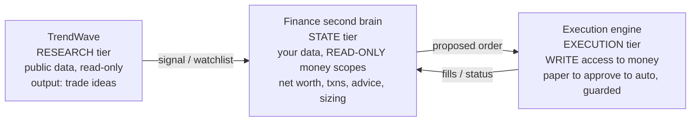

# Blueprint: A Cross-Border "Second Brain" for Your Financial Life

**Prepared:** 2026-06-19
**Context:** You interned in the US in 2024 (opened US bank + brokerage accounts), now live in Canada on a temporary visa (Canadian bank + brokerage accounts). You currently track net worth by pasting screenshots into a Gemini chat. You want something more granular — connect all accounts, review transactions, track net worth, set goals — as a separate app from TrendWave. Your existing TrendWave app is a **local-first Tauri v2 (Rust + React/TS + SQLite)** desktop app, so you already have the exact skill set this project needs.

> ⚠️ **Not financial, tax, immigration, or legal advice.** This is an engineering blueprint. The cross-border tax notes are context only — confirm anything tax-related with a cross-border CPA.

---

## 1. TL;DR — The recommendation in one screen

1. **The hard 20% is account connectivity, not the app.** No single aggregator connects *all* of Robinhood + Questrade + Bask Bank + Chase. You'll combine **2–3 connectors plus manual/CSV import**. Design for that from day one.
2. **Brokerages → SnapTrade.** It's the only sanctioned way to read **Robinhood** holdings into your own app, and it also covers **Questrade**, Wealthsimple, IBKR, etc. As a single user you fall inside SnapTrade's **free tier ($0)**. ([snaptrade.com/pricing](https://snaptrade.com/pricing), [docs.snaptrade.com/docs/integrations](https://docs.snaptrade.com/docs/integrations))
3. **US banks (Chase, Bask) → SimpleFIN Bridge ($15/yr) or Plaid.** SimpleFIN is the most *individual-friendly* path (read-only, no business/production approval). Plaid is more polished but is built for companies. ([beta-bridge.simplefin.org](https://beta-bridge.simplefin.org/), [plaid.com/pricing](https://plaid.com/pricing/))
4. **Canadian bank (Scotiabank) → SimpleFIN *or* Plaid Canada.** Scotiabank is one of the big-5 and is covered by **both** SimpleFIN (via MX) and Plaid. Because SimpleFIN also covers your US banks, **one $15/yr SimpleFIN connector can handle Chase + Bask + Scotiabank together** — so your whole build needs just **two connectors** (SnapTrade for brokerages, SimpleFIN for banks). ([plaid.com/institutions/scotiabank](https://plaid.com/institutions/scotiabank/), [beta-bridge.simplefin.org](https://beta-bridge.simplefin.org/), [openbankingtracker.com/mx](https://www.openbankingtracker.com/api-aggregators/mx))
5. **Don't necessarily build from scratch first.** **Wealthfolio** (open-source, local-first, Tauri/Rust — nearly your exact stack and vision) and **Ghostfolio** already do 70% of this. Fork/run one to learn, then build your own if you still want to. ([github.com/wealthfolio/wealthfolio](https://github.com/wealthfolio/wealthfolio))
6. **If you build:** mirror TrendWave — Tauri v2 + Rust + SQLite (encrypted) + React/TS. Add a **multi-currency ledger**, **time-series balance snapshots** for net-worth history, and an **"ask my finances" AI layer** to replace the Gemini screenshot ritual.
7. **Model-agnostic AI, not one LLM.** **GitHub Models** gives you **free** frontier models via your GitHub PAT (OpenAI-compatible API); **Ollama** covers local/private; **Azure** covers best-data-terms. One OpenAI-compatible client + a model **picker** lets you switch per question, with a **local-only privacy mode**. (See §7.6.)
8. **Automating trades is a separate, higher-risk tier — keep it out of TrendWave.** You **can't** safely automate Robinhood (read-only/ToS) and **live Questrade needs partner approval**, so real automation means a trading-API broker like **Alpaca** (free paper trading). Put execution in its own **guarded, opt-in module** — never in the research tool. (See §6.)

**All-in connector cost for *you* as a single user: ~$15/year** — SnapTrade (free) + one SimpleFIN connector ($15/yr) covers **every** account (Robinhood, Questrade, Chase, Bask, Scotiabank). Budget a few $/mo only if you choose Plaid instead of SimpleFIN.

---

## 2. What a "second brain for finances" actually needs to do

Breaking your ask into capabilities:

| Capability | What it means for the data model |
|---|---|
| Connect all accounts | Pluggable **connectors** (SnapTrade, Plaid, SimpleFIN, direct APIs, manual) writing into one normalized schema |
| Review transactions | A **transactions** table with categorization, merchant, currency, account FK |
| Track net worth | **Balance snapshots** over time + **FX conversion** to a single "home currency" |
| Multi-currency (USD + CAD) | Every money value carries a currency; an **fx_rates** table; net worth shown in USD *and* CAD |
| Set & track goals | A **goals** table (target amount, currency, target date, linked accounts) |
| "Second brain" Q&A | An LLM layer doing RAG over your own SQLite DB; optional screenshot/OCR ingestion |
| Switch AI models freely | A **provider registry** (GitHub Models / Ollama / Azure) behind one OpenAI-compatible client + a per-question model picker |
| (Optional) automate trades | A **separate, guarded execution module** (Alpaca paper → approve → auto) — never mixed with read-only data |

The screenshot-to-Gemini workflow you have today is essentially **manual balance snapshots + an LLM on top**. The app formalizes the snapshots (ideally auto-synced) and keeps the LLM, but now it's reading structured, trustworthy data instead of guessing from images.

---

## 3. The hard part: connecting *your* specific institutions

There is **no aggregator that cleanly connects all four** of your named institutions. Here's the institution-by-institution reality (verify live status in each provider's coverage explorer — coverage shifts).

| Institution | Type / Country | Plaid | SnapTrade | SimpleFIN | Direct API | Recommended path |
|---|---|---|---|---|---|---|
| **Chase** | US bank | ✅ Full (OAuth: auth, balance, transactions) | — | ✅ (MX-backed) | No public consumer API | **Plaid or SimpleFIN** |
| **Bask Bank** | US online savings (division of Texas Capital Bank) | ⚠️ Likely (balance; verify) | — | ⚠️ Likely (verify) | No | **Plaid/SimpleFIN; manual fallback** |
| **Robinhood** | US brokerage | ❌ Can't pull RH holdings into 3rd-party apps via Plaid | ✅ **Read-only** | — | ❌ No public API | **SnapTrade** |
| **Questrade** | CA brokerage | ⚠️ Partial/unreliable | ✅ Aggregation (TFSA/RRSP/FHSA) | — | ✅ **Official REST API** (free personal token) | **SnapTrade or Questrade API** |
| **Scotiabank** | CA bank | ✅ (balances, transactions, auth, assets) | — | ✅ (via MX) | No | **SimpleFIN (one connector w/ US banks) or Plaid CA** |
| Anything else (crypto, foreign, niche) | — | mostly ❌ | crypto via some | — | varies | **Manual + CSV import** |

Sources: Plaid coverage & products ([plaid.com/docs/institutions](https://plaid.com/docs/institutions/)); Scotiabank on Plaid ([plaid.com/institutions/scotiabank](https://plaid.com/institutions/scotiabank/)) and on SimpleFIN/MX ([openbankingtracker.com/mx](https://www.openbankingtracker.com/api-aggregators/mx)); Robinhood-can't-be-pulled-via-Plaid + Chase OAuth ([brokerage-review.com](https://www.brokerage-review.com/bank/accepted/robinhood-supported-banks.aspx), [econumo.com](https://econumo.com/posts/list-of-plaid-supported-banks/)); SnapTrade Robinhood/Questrade ([snaptrade.com/brokerage-integrations/robinhood-api](https://snaptrade.com/brokerage-integrations/robinhood-api), [docs.snaptrade.com/docs/integrations](https://docs.snaptrade.com/docs/integrations)); Questrade API ([questrade.com/api/documentation](https://www.questrade.com/api/documentation)); SimpleFIN ([beta-bridge.simplefin.org](https://beta-bridge.simplefin.org/)).

**Key takeaway:** plan for a **multi-provider architecture + a first-class manual/CSV path**. The manual path is also how you'll seed history (e.g., from your Gemini export) and cover the long tail.

---

## 4. Aggregation providers — deep dive

### 4.1 SnapTrade — *your brokerage workhorse* ✅ recommended
- **Covers:** Robinhood (read-only), Questrade, Wealthsimple, Fidelity, Schwab, Webull, E*Trade, IBKR, Public, tastytrade, etc. (30+ brokerages). ([docs.snaptrade.com/docs/integrations](https://docs.snaptrade.com/docs/integrations))
- **Why it matters:** Robinhood has **no public API**, and Plaid won't expose Robinhood holdings to third-party apps. SnapTrade is effectively the only sanctioned read path. ([snaptrade.com/brokerage-integrations/robinhood-api](https://snaptrade.com/brokerage-integrations/robinhood-api))
- **Security:** SOC 2 Type 2, OAuth, read-only by default; your app never sees brokerage credentials.
- **Pricing (this is the big one for you):** Free tier = **1 connected user, full features, $0**. Pay-as-you-go: first **5 users free**, then **$1/user/mo read-only (daily)** or **$2/user/mo real-time**. **As a single personal user, you're free.** ([snaptrade.com/pricing](https://snaptrade.com/pricing), [docs.snaptrade.com/docs/billing](https://docs.snaptrade.com/docs/billing))
- **Returns:** accounts, positions/holdings **with market value**, balances, and activities — so you often won't need a separate price feed for connected brokerages.

### 4.2 Plaid — polished, but built for companies
- **Best for:** Chase and other US banks (full OAuth: auth, balance, **transactions**), plus Canadian big-5 + Desjardins. Investments/Liabilities products available in US & Canada. ([plaid.com/docs/institutions](https://plaid.com/docs/institutions/))
- **Robinhood caveat:** Plaid is what *Robinhood* uses to link your external bank *into* Robinhood — you **cannot** go the other way and pull Robinhood holdings into your app via Plaid. ([brokerage-review.com](https://www.brokerage-review.com/bank/accepted/robinhood-supported-banks.aspx))
- **Pricing:** Pay-as-you-go, **no monthly minimum**; a **Trial** lets you connect up to ~5–10 production Items free with major products; per-call pricing isn't public until you apply for production. ([plaid.com/pricing](https://plaid.com/pricing/), [plaid.com/docs/account/billing](https://plaid.com/docs/account/billing/))
- **Friction:** You apply as a "company," go through production approval, and manage OAuth redirect/webhooks. Heavier than SimpleFIN for a personal project, but the best DX and the broadest single integration spanning US + Canada.

### 4.3 SimpleFIN Bridge — *most individual-friendly bank sync* ✅ recommended for US banks
- **Model:** "A window on a safe" — read-only financial interchange, like RSS for transactions. You get a **Setup Token → exchange for an Access URL → GET /accounts**. No credentials ever touch your app. ([simplefin.org](https://www.simplefin.org/), [developer guide](https://beta-bridge.simplefin.org/info/developers))
- **Coverage:** US banks/credit unions (MX-backed); some Canadian. Connect up to **25 institutions and 25 apps**.
- **Limits:** Designed for **daily** updates (~24 requests/day), 90-day history windows per request. ([developer guide](https://beta-bridge.simplefin.org/info/developers))
- **Pricing:** **$1.50/month or $15.00/year** + tax — for personal use. (Note: a generic web summary claimed it was "free" — that's **wrong**; confirmed $15/yr on the Bridge homepage.) ([beta-bridge.simplefin.org](https://beta-bridge.simplefin.org/))
- **Why it's great for you:** No business entity, no production review, trivially simple protocol — ideal for a personal local-first app. This is what many Actual Budget self-hosters use.

### 4.4 Canadian bank aggregators — Flinks / MX / Yodlee / Salt Edge / Finicity
- **Flinks:** deepest Canadian coverage (incl. credit unions/challengers), strong OAuth — but enterprise sales motion, weak outside Canada. ([openbankingtracker.com](https://www.openbankingtracker.com/api-aggregators/compare), [candor.co](https://candor.co/articles/it-buyers-guide/the-best-plaid-competitors-according-to-8-clients))
- **MX, Yodlee, Salt Edge, Finicity (Mastercard):** all viable for Canada to varying degrees but are **enterprise-oriented** (harder for an individual to onboard than Plaid/SimpleFIN). ([fintegrationfs.com](https://www.fintegrationfs.com/post/plaid-vs-yodlee-2026-technical-comparison-for-bank-data-access))
- **Practical pick for you:** **Scotiabank** is covered by both **SimpleFIN (via MX)** and **Plaid** — so you don't need Flinks. Use **SimpleFIN** to handle Scotiabank in the *same* connector as your US banks (cheapest, simplest), or **Plaid Canada** if you prefer its DX. Reserve Flinks for niche Canadian credit unions Plaid/MX miss. ([plaid.com/institutions/scotiabank](https://plaid.com/institutions/scotiabank/))

### 4.5 Direct / official APIs (free, but DIY)
- **Questrade REST API:** official, OAuth/personal-access-token, free. Endpoints: `GET /v1/accounts`, `/accounts/{id}/positions`, `/balances`, `/activities`. Great free alternative to SnapTrade for Questrade specifically — but tokens are short-lived and you maintain refresh logic. ([questrade.com/api/documentation](https://www.questrade.com/api/documentation))
- **Coinbase / Kraken / exchanges:** official read APIs if you hold crypto.

### 4.6 What to AVOID: unofficial Robinhood APIs (`robin_stocks`, `pyhood`)
- They reverse-engineer Robinhood's private endpoints. Using them **violates Robinhood's ToS**, risks **account lockout/suspension/forced 2FA**, and **breaks frequently** without notice. Don't point these at your real account. Use **SnapTrade** instead. ([github.com/jmfernandes/robin_stocks/issues](https://github.com/jmfernandes/robin_stocks/issues), [pyhood](https://pypi.org/project/pyhood/))

---

## 5. Build vs. buy — look at these *before* writing code

You explicitly want to build from scratch, and that's a great learning project. But you should at least *evaluate* (and maybe fork) these, because several are uncannily close to your vision and stack:

| Project | Stack | Fit to your goal | License | Link |
|---|---|---|---|---|
| **Wealthfolio** ⭐ | **Tauri + Rust** (local-first desktop/mobile) | **Almost your exact app & stack:** "private, local-first personal finance tracker — investments, net worth, spending, simulations." Optional paid **Connect** add-on does brokerage sync (SnapTrade-style). | Open source | [github.com/wealthfolio/wealthfolio](https://github.com/wealthfolio/wealthfolio), [wealthfolio.app](https://wealthfolio.app/) |
| **Ghostfolio** | Angular + NestJS + Prisma + Postgres | Excellent **multi-currency investment/net-worth** tracking, auto price updates, allocations, TWR/MWR. Self-host or use as a feature reference. Weak on day-to-day budgeting. | AGPL-3.0 | [github.com/ghostfolio/ghostfolio](https://github.com/ghostfolio/ghostfolio) |
| **Actual Budget** | React + Node (local-first sync) | Best **envelope budgeting + transaction review**; syncs banks via **SimpleFIN**. Not for investments. | MIT | [actualbudget.org](https://actualbudget.org/) |
| **Firefly III** | PHP + MySQL/Postgres | **Double-entry**, multi-currency, deep reporting/API. Powerful "finance hub," less pretty for investments. | AGPL-3.0 | [firefly-iii.org](https://www.firefly-iii.org/) |
| **Maybe Finance** | Ruby on Rails | All-in-one budgeting+investments, but **company shut down / repo archived** (community fork "**Sure**" by we-promise). Good **data-model reference** only. | AGPL-3.0 | fork: [we-promise](https://github.com/we-promise) |

Comparisons: [dev.to/selfhostingsh ghostfolio-vs-maybe](https://dev.to/selfhostingsh/ghostfolio-vs-maybe-2ma1), [selfhostable.dev firefly-vs-actual](https://selfhostable.dev/blog/firefly-iii-vs-actual-budget-self-hosted-finance/).

**My honest recommendation:**
- **Fastest path to value:** run **Wealthfolio** (matches your privacy + Tauri preference) for investments/net worth, and/or **Actual Budget + SimpleFIN** for bank transactions. You could be tracking real net worth this week.
- **If you want to own it / learn / customize the cross-border + LLM angle:** build from scratch in the TrendWave stack, but **borrow Wealthfolio's and Maybe's data models** rather than inventing one. A realistic hybrid: **fork Wealthfolio** and add your cross-border + "second brain" features on top.

---

## 6. The "divide": research → money-state → execution (where automated trading belongs)

Adding **automated buy/sell** changes the calculus, because trading is a *fundamentally higher-risk capability* than everything else you've described. Think in **three trust tiers**, separated by what each is allowed to touch:



| Tier | App / module | Data it touches | Failure blast radius | Security posture |
|---|---|---|---|---|
| **Research** | **TrendWave** | Public prices/news, your prompts | A bad *idea* (you can ignore it) | Low — no credentials, shareable |
| **State** | **New finance app** | Your balances/holdings/txns (read-only) | Privacy leak | High — encrypted, read-only scopes |
| **Execution** | **Separate execution module** | Order placement (**write**) | **Real money lost** | Highest — paper-first, approvals, kill switch, audit |

**The recommended divide:**

1. **Keep TrendWave pure read-only research.** Don't give a research tool your brokerage *write*-credentials. It already produces ranked picks — let it **emit a typed "signal"** (symbol, direction, conviction, thesis) that the finance app can ingest. Mixing money-moving keys into TrendWave means every research tweak risks your funds, and vice-versa.
2. **Put portfolio state + advice in the new finance app (read-only).** This is ~90% of everything you've asked for across all three messages: aggregation, net worth, transactions, goals, "ask my finances." Read-only money scopes only.
3. **Put automated execution in its own bounded module** — ideally a **separate process/service** the finance app talks to over a typed contract, even if it ships inside the same binary. It's **off by default** and is the *only* component that ever holds trade-enabled credentials.

**Why execution must be isolated (not sprinkled into either app):**
- **Blast radius:** a bug in a read-only dashboard shows a wrong number; a bug in execution **buys 10,000 shares at market.** Different review bar, different testing rigor.
- **Credentials:** trade scopes are far more dangerous than read scopes — quarantine them.
- **Cadence:** research iterates fast and loose; execution should change rarely, only behind tests + paper trading.
- **Auditability:** every order needs an immutable audit log, an idempotency key (no duplicate fills on retry), and a kill switch.

### 6.1 The brokerage reality that forces your hand
You literally **cannot safely automate most of your current accounts:**
- **Robinhood → no sanctioned automation.** No official API; SnapTrade is **read-only** for Robinhood; unofficial APIs (`robin_stocks`) violate ToS and risk a ban/lockout. **Do not automate Robinhood.** ([SnapTrade read-only](https://www.infnits.com/features/brokerage-sync), [robin_stocks issues](https://github.com/jmfernandes/robin_stocks/issues))
- **Questrade → live order placement needs partner approval.** Personal access tokens can place orders only in the **practice/sandbox** environment; live `POST /orders` is restricted to approved Questrade **partner** developers (apply via apisupport@questrade.com). ([Questrade getting started](https://www.questrade.com/api/documentation/getting-started))
- **Banks (Chase, Bask, Scotiabank)** — irrelevant to trading.

**So if you genuinely want automation, open an account at a trading-API-first broker:**
- **Alpaca** ⭐ — purpose-built trading API, **free realistic paper trading**, commission-free US stocks/ETFs/crypto, fully automatable directly **and** via SnapTrade. Best starting point. ([alpaca.markets](https://alpaca.markets/), [docs.alpaca.markets](https://docs.alpaca.markets/))
- **Interactive Brokers** — global, multi-asset, advanced (steeper API). **Tradier** — US options via API (platform fee).
- Keep **Robinhood/Questrade for manual** trading + read-only tracking; route **automated** strategies through **Alpaca/IBKR**. For brokers without trade APIs, "automation" degrades to *generate the order, you place it manually* (one-tap deep link / copy).

### 6.2 Guardrails the execution module must have (non-negotiable)
Automated trading with real money is where people get hurt. Bake these in from day one:
- **Paper-trade first** (Alpaca paper) — never debut a strategy on real funds.
- **Human-in-the-loop by default:** propose order → you approve → it executes. Full auto only after you trust it, behind an explicit opt-in.
- **Kill switch / "STOP" flag** that halts all trading instantly.
- **Hard limits:** max order size, symbol allowlist, max daily orders/notional, max-drawdown halt.
- **Idempotency keys** so a network retry never double-submits an order.
- **PDT guard:** in a US margin account under **$25k**, 4+ day-trades in 5 business days triggers Pattern-Day-Trader restrictions — track day-trade count and halt at 3. ([PDT rule](https://www.investor.gov/introduction-investing/investing-basics/glossary/pattern-day-trader))
- **Wash-sale awareness:** selling at a loss and rebuying the same security within 30 days disallows the loss — extra-thorny **cross-border** (US + CA). Flag/avoid in automation; track tax lots. (IRS wash-sale rule, Pub. 550.)
- **Full audit log** of every signal, decision, order, and fill.
- **Not investment advice / not a profit guarantee** — disclaim in-app.

**Bottom line on the divide:** **three concerns, three trust tiers.** TrendWave = research (read-only, public). New app = your financial state + advice (read-only, private). Execution = a separate, guarded, opt-in module that targets a trading-API broker like Alpaca. Don't merge execution into TrendWave (scope creep + risk), and don't let it share a trust boundary with your read-only dashboard.

---

## 7. Recommended architecture (if you build from scratch)

### 7.1 Stack — mirror TrendWave (you already know it, it's local-first, privacy-friendly)
- **Shell:** Tauri v2 (Rust core + web frontend) — financial data stays on your machine.
- **Backend:** Rust — `tokio` (async sync jobs), `reqwest` (provider HTTP), `rusqlite` + **SQLCipher** (encrypted local DB), `serde`, `thiserror`.
- **Frontend:** React + TypeScript + Tailwind (+ a charting lib for net-worth-over-time, e.g. Recharts/visx).
- **Intelligence (optional "second brain"):** a **model-agnostic** AI layer — GitHub Models (free frontier), local Ollama (private), or Azure/OpenAI — all behind one OpenAI-compatible client (see §7.6).
- **Secrets:** OS keychain via the **`keyring`** crate or **Tauri Stronghold** plugin; store the SQLCipher key there, never in code. ([keyring crate](https://crates.io/crates/keyring), Tauri Stronghold plugin)

### 7.2 Connector abstraction (the most important design decision)
Define one trait every provider implements, so the rest of the app never cares *how* data arrived:

```rust
// pseudo-Rust
pub trait AccountConnector {
    fn provider(&self) -> Provider;                 // SnapTrade | Plaid | SimpleFIN | Questrade | Manual | Csv
    async fn link(&self, ctx: &LinkCtx) -> Result<ConnectionId>;     // OAuth / token / setup-token / file
    async fn sync_accounts(&self, c: ConnectionId) -> Result<Vec<Account>>;
    async fn sync_balances(&self, c: ConnectionId) -> Result<Vec<BalanceSnapshot>>;
    async fn sync_transactions(&self, c: ConnectionId, since: Date) -> Result<Vec<Txn>>;
    async fn sync_holdings(&self, c: ConnectionId) -> Result<Vec<Holding>>; // brokerages only
}
```

Connectors to implement, in priority order: **Manual/CSV → SnapTrade → SimpleFIN (or Plaid) → Questrade API → Plaid Canada/Flinks**.

### 7.3 Normalized data model (SQLite)
```
institutions(id, name, country, provider, logo)
connections(id, institution_id, provider, status,
            access_token_ref /* keychain ref, NOT the token */, last_synced_at)
accounts(id, connection_id, institution_id, external_id, name,
         type /* chequing|savings|brokerage|tfsa|rrsp|fhsa|401k|ira|roth|credit|crypto */,
         currency, jurisdiction /* US|CA */, is_manual)
balance_snapshots(id, account_id, as_of_date, balance, currency)   -- powers net-worth history
holdings(id, account_id, symbol, quantity, cost_basis, market_value, currency, as_of_date)
securities(symbol, name, asset_class, exchange, currency)
transactions(id, account_id, posted_date, amount, currency, description,
             merchant, category, transfer_group_id)
fx_rates(date, base_ccy, quote_ccy, rate)                          -- e.g., USD->CAD
goals(id, name, target_amount, currency, target_date, account_filter)
categories(id, name, parent_id)
```

### 7.4 Multi-currency net worth (your core differentiator)
- Pick a **home currency** (toggle USD ⇄ CAD). Net worth = Σ(account balance → converted via `fx_rates`).
- **FX source:** Bank of Canada Valet API (official USD/CAD), or free `exchangerate.host` / Frankfurter. Cache daily into `fx_rates`. Always show **both** USD and CAD totals.
- **Security pricing for manual holdings:** reuse TrendWave's **Yahoo Finance** integration. Connected brokerages already return market value via SnapTrade.
- **Net-worth history:** write a `balance_snapshots` row per account per sync (or daily). The time series is your headline chart and replaces the "ask Gemini what my net worth is" loop.

### 7.5 Security checklist (financial data = treat as crown jewels)
- Local-first; **no financial data leaves the device** except calls to the providers themselves (and, only if you opt in, a cloud LLM).
- **Encrypt the DB** (SQLCipher); store the key in the **OS keychain**.
- Store provider tokens **encrypted / in keychain**, referenced by handle — never in SQLite plaintext or git.
- Prefer **read-only** scopes everywhere (SnapTrade, SimpleFIN, Plaid balance/transactions). No money-movement scopes.
- `.gitignore` all secrets; use a `.env.example`. Never commit `client_secret`s.

### 7.6 Model-agnostic "bring-your-own-model" AI layer
Don't hard-wire one model. **GitHub Models, Azure OpenAI, OpenAI, and Ollama all speak the OpenAI Chat Completions API**, so a single OpenAI-compatible client + a provider registry lets you hot-swap models — even **per question** when asking for financial advice.

- **GitHub Models (your free frontier access):** OpenAI-compatible base URL `https://models.github.ai/inference` (POST `/chat/completions`); auth = a GitHub **PAT with the `models:read` scope** as the bearer token; model IDs are `publisher/model` (e.g. `openai/gpt-4.1`); list them live from `https://models.github.ai/catalog/models`. **Free** for personal accounts, **rate-limited per model** (low tiers ~15 req/min, 150/day; the biggest models far less) — fine for occasional advice, not high-volume. ([quickstart](https://docs.github.com/en/github-models/quickstart), [REST inference](https://docs.github.com/en/rest/models/inference))
- **Ollama (local, private):** OpenAI-compatible at `http://localhost:11434/v1` — your offline / max-privacy fallback (reuse TrendWave's setup). ([Ollama OpenAI compat](https://github.com/ollama/ollama/blob/main/docs/openai.md))
- **Azure OpenAI / Azure AI Foundry (you likely have this as a Microsoft employee):** enterprise-grade, **best data terms** — not used for training by default, 30-day abuse retention, Zero-Data-Retention available. Preferred for sending real balances. ([Azure OpenAI data privacy](https://learn.microsoft.com/en-us/legal/cognitive-services/openai/data-privacy))
- **OpenAI / Anthropic / Gemini direct (optional):** if you want native keys/features.

**Design:**
```rust
pub struct LlmProvider { id, display_name, base_url, api_key_ref /*keychain*/, default_model }
pub trait ChatModel {
  async fn chat(&self, model:&str, msgs:Vec<Msg>, opts:ChatOpts) -> Result<TokenStream>;
}
```
- One `OpenAiCompatClient` covers GitHub Models + Ollama + OpenAI + Azure by swapping `base_url` + key.
- A **model picker** in the UI (provider + model), selectable **per question**, so you can A/B a financial-advice answer across e.g. GPT-5, Claude, and a local Llama.
- A **"Local-only / private mode"** toggle that forces Ollama and disables all cloud calls.
- Fetch the GitHub Models **catalog at runtime** so new frontier models appear automatically.

**Rust libraries:** simplest is **`async-openai`** ([64bit/async-openai](https://github.com/64bit/async-openai)) pointed at each OpenAI-compatible base URL. For native multi-provider (incl. Anthropic/Gemini) use **`genai`** ([jeremychone/rust-genai](https://github.com/jeremychone/rust-genai) — "Ollama, OpenAI, Anthropic, Gemini, DeepSeek, xAI/Grok, Groq, Cohere…") or **`rig`** ([0xPlaygrounds/rig](https://github.com/0xPlaygrounds/rig)).

**Privacy for financial advice (important):** switching models means each query is an explicit choice about *where your data goes*.
- Prefer **local Ollama** or **Azure** for anything with real balances. Azure doesn't train on your data by default and offers Zero-Data-Retention.
- Treat the **GitHub Models free tier as experimentation**; verify its current data-use terms before sending real figures, and consider **redacting/aggregating** (send % changes, ratios, or rounded buckets — not exact balances/account numbers).
- GitHub has signaled broader use of *Copilot* interaction data for training (opt-out) from 2026 — another reason to keep real numbers on local/Azure paths and send only de-identified context to frontier endpoints. ([GitHub privacy update](https://github.blog/changelog/2026-03-25-updates-to-our-privacy-statement-and-terms-of-service-how-we-use-your-data/))

---

## 8. Cross-border domain considerations (context, not advice)

Your situation has nuances a generic finance app ignores — surfacing them is part of the "second brain" value:

- **Two tax systems, possibly overlapping.** A 2024 US internship may make you a US tax filer for that year; living in Canada now likely makes you a **Canadian tax resident** (taxed on worldwide income). Tag every account with **jurisdiction** so you can answer "what's my US-side vs CA-side net worth?"
- **Account-type gotchas.** Canadian **TFSA/RRSP/FHSA** are tax-sheltered in Canada but can be **messy if you're ever a US person** (PFIC/reporting issues). US **401k/IRA/Roth** have their own cross-border treatment. The app shouldn't advise — but it *should* clearly label account types and jurisdictions.
- **Reporting reminders (informational):** US persons may have **FBAR/FATCA** foreign-account reporting; Canada has **T1135** for foreign property above thresholds. A "second brain" can *remind* you to check with a pro — it must not pretend to file.
- **Currency is first-class, not an afterthought.** Your net worth genuinely lives in two currencies; FX swings move your number. Always show both and store the rate used.
- **Recommendation:** include a one-line disclaimer in-app and keep a "consult a cross-border CPA" nudge near tax-flavored features.

---

## 9. Phased roadmap

**Phase 0 — Decide & scaffold.** Choose build-from-scratch vs fork Wealthfolio. Spin up the Tauri project (or fork). Set up encrypted SQLite + keychain.

**Phase 1 — Manual MVP that already beats Gemini.** Accounts + manual balances + multi-currency net worth + history chart + dashboard. **Seed it from your Gemini export** (Section 10). This alone retires the screenshot ritual.

**Phase 2 — Brokerages via SnapTrade.** Robinhood + Questrade + Wealthsimple holdings auto-sync (free tier). Net worth now updates itself for investments.

**Phase 3 — Banks.** SimpleFIN (US: Chase, Bask) and/or Plaid; Plaid CA or Flinks for Canadian banks. Transaction list + categorization + transfer de-duplication.

**Phase 4 — Goals, budgets, insights.** Goal tracking, recurring/subscription detection, net-worth-over-time, spending by category, alerts.

**Phase 5 — The "second brain" AI layer (model-agnostic).** RAG over your SQLite DB with a **model picker** (GitHub Models / Ollama / Azure) + a **local-only privacy mode**: "How did my CAD net worth change this quarter?" / "List USD subscriptions." Optional **screenshot/OCR ingestion** to auto-extract balances from images — directly replacing what you do manually in Gemini today. (See §7.6.)

**Phase 6 — (Optional) automated execution — a separate, guarded module.** Only if you want trading: stand up an **isolated** execution module against **Alpaca paper trading** first. Human-approve every order; add kill switch, hard caps, idempotency, PDT/wash-sale guards, and an audit log. Promote to live + full-auto only after you trust it. **Do not automate Robinhood**; keep Questrade manual unless you obtain partner approval. (See §6.)

---

## 10. Ready-to-paste prompt to extract your Gemini context

Paste this into your existing Gemini chat. It dumps everything into a structured file you can import to seed Phase 1.

```
You have been tracking my personal finances and net worth across US and Canadian
accounts. Export EVERYTHING you currently know about my financial situation as a
single JSON document (and a short human-readable summary after it). Do not omit
anything; if a value is an estimate or uncertain, mark "confidence": "low" and
explain. Use this exact schema:

{
  "as_of_date": "YYYY-MM-DD",
  "home_currency_preference": "USD or CAD",
  "people": [{ "name": "", "residency_status": "", "visa_or_status_notes": "" }],
  "institutions": [
    { "name": "", "country": "US|CA", "type": "bank|brokerage|crypto|other",
      "login_or_app": "", "notes": "" }
  ],
  "accounts": [
    { "institution": "", "account_name": "", "account_type": "chequing|savings|brokerage|TFSA|RRSP|FHSA|401k|IRA|Roth|credit|crypto|other",
      "currency": "USD|CAD|other", "jurisdiction": "US|CA",
      "current_balance": 0, "as_of_date": "YYYY-MM-DD", "confidence": "high|med|low" }
  ],
  "holdings": [
    { "account": "", "symbol": "", "name": "", "quantity": 0,
      "approx_value": 0, "currency": "", "confidence": "" }
  ],
  "balance_history": [
    { "account": "", "date": "YYYY-MM-DD", "balance": 0, "currency": "" }
  ],
  "recurring_items": [
    { "type": "income|bill|subscription|transfer", "name": "", "amount": 0,
      "currency": "", "cadence": "monthly|biweekly|annual" }
  ],
  "fx_assumptions": [{ "pair": "USD/CAD", "rate": 0, "as_of": "YYYY-MM-DD" }],
  "net_worth_snapshots": [
    { "date": "YYYY-MM-DD", "total_usd": 0, "total_cad": 0, "method": "" }
  ],
  "goals": [
    { "name": "", "target_amount": 0, "currency": "", "target_date": "YYYY-MM-DD", "notes": "" }
  ],
  "open_questions": [""],
  "assumptions_you_have_been_making": [""]
}

Rules: Output valid JSON first (no prose inside the code block), then a brief plain
summary. Include every account, balance, and goal you've ever recorded for me,
with dates. Flag anything you're inferring vs. something I explicitly told you.
```

---

## 11. Ready-to-paste kickoff prompt for a new Copilot CLI session

Create a **new project** (not in TrendWave), then start a session with this:

```
I'm building a LOCAL-FIRST, privacy-first desktop app called "<your name here>"
— a personal-finance "second brain" for my cross-border (US + Canada) finances.
I currently track net worth by pasting screenshots into a chatbot; I want to
replace that with a real app that connects my accounts, reviews transactions,
tracks multi-currency net worth over time, and supports goals.

Stack (match my other app, TrendWave): Tauri v2 (Rust core + React/TypeScript +
Tailwind), local SQLite encrypted with SQLCipher, secrets in the OS keychain via
the `keyring` crate. Reuse a Yahoo Finance price lookup. For the "ask my finances"
feature, build a MODEL-AGNOSTIC LLM layer (one OpenAI-compatible client + a provider
registry) so I can switch models per question: GitHub Models (free frontier via my
GitHub PAT with models:read scope, base url https://models.github.ai/inference),
local Ollama (http://localhost:11434/v1) for a private mode, and optionally Azure/OpenAI.

Accounts I need to connect (design a pluggable connector abstraction; not all use
the same provider):
- Robinhood (US brokerage)  -> SnapTrade (read-only; free single-user tier)
- Questrade (CA brokerage)  -> SnapTrade OR official Questrade REST API
- Chase (US bank)           -> SimpleFIN Bridge ($15/yr) or Plaid
- Bask Bank (US savings)    -> SimpleFIN/Plaid, manual fallback
- Scotiabank (CA bank)      -> SimpleFIN Bridge (covers it via MX) or Plaid Canada
- Everything else           -> manual entry + CSV import (build this FIRST)

Hard requirements:
- Multi-currency: every value carries a currency; store fx_rates (USD<->CAD);
  show net worth in BOTH USD and CAD with a home-currency toggle.
- Net-worth history via per-account balance_snapshots time series + a chart.
- Tag accounts by type (chequing/savings/brokerage/TFSA/RRSP/FHSA/401k/IRA/Roth/
  credit/crypto) and jurisdiction (US/CA).
- Aggregation is READ-ONLY (no money movement). Any trade execution lives in a
  SEPARATE, opt-in, guarded module (off by default) — never mixed into the read-only
  dashboard. Encrypt the DB; never commit secrets.
- An importer to seed data from a JSON export (schema I'll provide).

Plan in phases:
1) Encrypted SQLite schema + manual/CSV accounts + multi-currency net worth + dashboard.
2) SnapTrade connector (Robinhood, Questrade, Wealthsimple holdings).
3) Bank sync (SimpleFIN for US; Plaid/Flinks for CA) + transaction review/categorization.
4) Goals, budgets, recurring detection, net-worth-over-time insights.
5) Model-agnostic "second brain": RAG over my SQLite DB with a model picker (GitHub
   Models / Ollama / Azure) + a local-only privacy mode + optional screenshot/OCR ingestion.
6) (Optional, SEPARATE guarded module) automated trading via Alpaca PAPER first —
   human-approve orders, kill switch, hard caps, idempotency, PDT/wash-sale guards,
   audit log. NOT Robinhood (read-only/ToS); Questrade live-trade needs partner approval.

Start with Phase 1: propose the SQLite schema, the Rust AccountConnector trait, and a
minimal Tauri+React dashboard showing total net worth in USD and CAD from manually
entered accounts. Then wait for my review before Phase 2.
```

> Tip: consider evaluating/forking **Wealthfolio** ([github.com/wealthfolio/wealthfolio](https://github.com/wealthfolio/wealthfolio)) first — it's a local-first Tauri/Rust finance tracker very close to this spec, and forking could save weeks.

---

## 12. Cost summary (single personal user)

| Component | Cost | Notes |
|---|---|---|
| SnapTrade (Robinhood, Questrade, Wealthsimple…) | **$0** | Free single-user / first-5-users tier ([snaptrade.com/pricing](https://snaptrade.com/pricing)) |
| Questrade official API (alt to SnapTrade) | **$0** | DIY token refresh ([questrade.com/api](https://www.questrade.com/api/documentation)) |
| SimpleFIN Bridge (US + CA banks: Chase, Bask, Scotiabank) | **$15/yr** | One connector covers all three; up to 25 institutions/25 apps, read-only ([beta-bridge.simplefin.org](https://beta-bridge.simplefin.org/)) |
| Plaid (alt for US + CA banks incl. Scotiabank) | **$0 to start** | No monthly minimum; trial Items free; per-call after ([plaid.com/pricing](https://plaid.com/pricing/)) |
| Flinks / MX / Yodlee (CA, if needed) | enterprise | Not needed for Scotiabank; only for niche CA credit unions |
| Yahoo Finance prices + FX (exchangerate.host / Bank of Canada) | **$0** | Reuse TrendWave's price code |
| Ollama (local LLM) | **$0** | Reuse TrendWave's setup |
| GitHub Models (frontier LLMs, your free access) | **$0** | OpenAI-compatible; rate-limited free tier ([docs](https://docs.github.com/en/github-models/quickstart)) |
| Azure OpenAI / Foundry (optional, best data terms) | pay-as-you-go | You likely have Microsoft-employee access |
| Alpaca (only if you automate trading) | **$0** | Free paper trading; commission-free US equities ([alpaca.markets](https://alpaca.markets/)) |
| **Realistic total** | **~$15/year** | SimpleFIN $15/yr; AI = $0 (GitHub Models free / local Ollama); automation = $0 (Alpaca paper). A few $/mo only if you pick Plaid or Azure. |

---

## 13. Risks, assumptions & open questions

**Assumptions I made (flag if wrong):**
- You're building this for **yourself only** (single user) — this is what makes SnapTrade free and SimpleFIN viable. A multi-user/SaaS version changes the economics and compliance picture significantly.
- "Bask Bank" = the US online savings bank (division of Texas Capital Bank). Its Plaid/SimpleFIN support is **likely but unconfirmed** — verify in the coverage explorer; keep manual entry as a fallback.
- You may also have **Wealthsimple** and/or crypto — both are connectable (Wealthsimple via SnapTrade; crypto via exchange APIs or manual).

**Risks / watch-outs:**
- **Coverage drifts.** Any "supported" institution can break when a bank changes its login/OAuth. Always keep manual/CSV as a safety net.
- **Plaid onboarding friction** for an individual (production approval) — SimpleFIN sidesteps this for US banks.
- **Never** use unofficial Robinhood scrapers on your real account (ToS/lockout risk).
- **Cross-border tax** is genuinely complex; the app should *organize and remind*, not *advise*. Loop in a cross-border CPA.
- Treat the encrypted DB key + provider tokens as **crown jewels**; keychain only.

**Open questions to resolve before Phase 2:**
1. ✅ **Resolved — Canadian bank is Scotiabank** (covered by both SimpleFIN/MX and Plaid; no Flinks needed).
2. Any **crypto** or **Wealthsimple** holdings to include?
3. Preferred **home currency** for the headline number (USD or CAD)?
4. Build-from-scratch vs **fork Wealthfolio** — how much do you value owning the code vs. speed?
5. SimpleFIN vs Plaid for banks — do you want the single cheap SimpleFIN connector ($15/yr, daily refresh), or Plaid's nicer DX/real-time at more setup friction?
6. **Do you actually want *live* automated trading, or is paper / semi-auto enough to start?** This determines whether you open an **Alpaca** account (the only practical automatable broker for your set — Robinhood can't, Questrade needs partner approval).
7. **Which AI providers first** — GitHub Models (free frontier), local Ollama (private), and/or Azure (best data terms)?

---

## 14. Sources

**Aggregators & APIs**
- Plaid institutions/coverage — https://plaid.com/docs/institutions/
- Scotiabank coverage — Plaid: https://plaid.com/institutions/scotiabank/ ; SimpleFIN/MX: https://www.openbankingtracker.com/api-aggregators/mx ; SimpleFIN institutions search: https://beta-bridge.simplefin.org/search-institutions
- Plaid pricing — https://plaid.com/pricing/ ; billing — https://plaid.com/docs/account/billing/
- Robinhood + Plaid direction (can't pull RH into 3rd-party apps) — https://www.brokerage-review.com/bank/accepted/robinhood-supported-banks.aspx
- Plaid supported-banks roundup — https://econumo.com/posts/list-of-plaid-supported-banks/
- SnapTrade integrations — https://docs.snaptrade.com/docs/integrations ; Robinhood — https://snaptrade.com/brokerage-integrations/robinhood-api
- SnapTrade pricing — https://snaptrade.com/pricing ; billing — https://docs.snaptrade.com/docs/billing
- Questrade API docs — https://www.questrade.com/api/documentation ; overview — https://www.questrade.com/api
- SimpleFIN — https://www.simplefin.org/ ; Bridge pricing — https://beta-bridge.simplefin.org/ ; developer guide — https://beta-bridge.simplefin.org/info/developers ; spec — https://www.simplefin.org/protocol.html
- Canadian aggregator comparison — https://www.openbankingtracker.com/api-aggregators/compare ; https://candor.co/articles/it-buyers-guide/the-best-plaid-competitors-according-to-8-clients ; https://www.fintegrationfs.com/post/plaid-vs-yodlee-2026-technical-comparison-for-bank-data-access
- Unofficial Robinhood risk — https://github.com/jmfernandes/robin_stocks/issues ; https://pypi.org/project/pyhood/

**Reference apps**
- Wealthfolio — https://github.com/wealthfolio/wealthfolio ; https://wealthfolio.app/ ; broker sync — https://wealthfolio.app/docs/guide/connect-broker-sync/
- Ghostfolio — https://github.com/ghostfolio/ghostfolio
- Actual Budget — https://actualbudget.org/
- Firefly III — https://www.firefly-iii.org/
- Maybe Finance (archived) / "Sure" fork — https://github.com/we-promise ; SimpleFIN→Maybe importer — https://github.com/steveredden/simplefin_to_maybe
- Comparisons — https://dev.to/selfhostingsh/ghostfolio-vs-maybe-2ma1 ; https://selfhostable.dev/blog/firefly-iii-vs-actual-budget-self-hosted-finance/

**Build/security**
- Tauri secure storage / `keyring` crate — https://crates.io/crates/keyring ; SQLCipher — https://www.zetetic.net/sqlcipher/
- TrendWave (your existing stack reference) — local repo `README.md`, `package.json`

**AI / model-agnostic layer**
- GitHub Models — quickstart https://docs.github.com/en/github-models/quickstart ; REST inference https://docs.github.com/en/rest/models/inference ; catalog https://docs.github.com/en/rest/models/catalog ; blog https://github.blog/ai-and-ml/llms/solving-the-inference-problem-for-open-source-ai-projects-with-github-models/
- Ollama OpenAI compatibility — https://github.com/ollama/ollama/blob/main/docs/openai.md
- Azure OpenAI data privacy — https://learn.microsoft.com/en-us/legal/cognitive-services/openai/data-privacy
- GitHub privacy/ToS update (2026) — https://github.blog/changelog/2026-03-25-updates-to-our-privacy-statement-and-terms-of-service-how-we-use-your-data/
- Rust LLM libraries — async-openai https://github.com/64bit/async-openai ; genai https://github.com/jeremychone/rust-genai ; rig https://github.com/0xPlaygrounds/rig

**Trading / execution**
- SnapTrade trading vs read-only (Robinhood read-only; Alpaca tradable) — https://www.infnits.com/features/brokerage-sync ; https://docs.snaptrade.com/docs/integrations
- Questrade order placement = partner-only (personal token = sandbox) — https://www.questrade.com/api/documentation/getting-started
- Alpaca trading API + free paper trading — https://alpaca.markets/ ; https://docs.alpaca.markets/
- Pattern Day Trader rule — https://www.investor.gov/introduction-investing/investing-basics/glossary/pattern-day-trader
- Robinhood unofficial-API ban risk — https://github.com/jmfernandes/robin_stocks/issues

> Coverage and pricing shift over time — re-verify each provider's coverage explorer and pricing page before committing to it.
